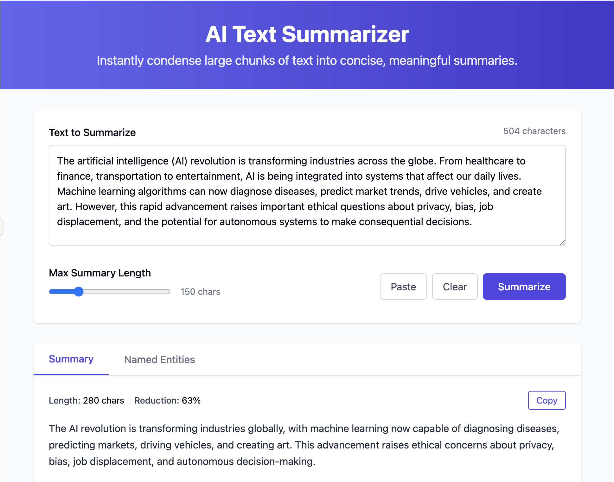
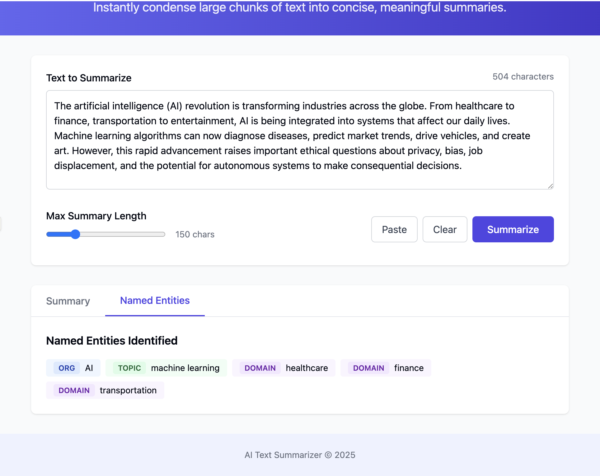

#AI Document Summarizer & Analyzer

**doc-summarizer-ai** is a full-stack AI-powered web application that helps users **summarize**, **analyze**, and **extract insights** from documents like **PDFs**, **DOCX**, and **plain text** files.  
Built with modern web technologies and Natural Language Processing (NLP) techniques, **doc-summarizer-ai** simplifies the process of understanding large amounts of text in seconds.

---

## 📸 Screenshots

<!-- Add your screenshots here -->



-->

---

## 🚀 Features

- 📄 Upload PDF, DOCX, or paste plain text for instant analysis  
- 🤖 AI-powered summarization using HuggingFace Transformers (BERT/GPT models)  
- 🔍 Named Entity Recognition (NER) & Keyword Extraction using spaCy  
- 📤 Export summaries as PDF or send via Email  
- 👥 User Authentication (JWT-based) with secure login/signup  
- 🕒 Document History & analysis tracking  
- ☁️ Cloud Storage for uploaded documents (local file system based)  

---

## ⚙️ Tech Stack

### 🎨 Front-End
- React.js with Tailwind CSS for responsive UI  
- REST API consumption with Axios  
- Document upload, preview, and summary UI  

### 🧠 Back-End
- Node.js with Express.js  
- Handles authentication, document routing, storage, and integration with AI microservice  

### 🧬 AI/NLP Microservice
- Python Flask microservice  
- Uses:
  - **spaCy** for NER and keyword extraction  
  - **HuggingFace Transformers** for summarization (BART, GPT2, DistilBERT models)  
- Receives text via REST API and returns summarized content + insights  

### 🗃️ Database
- MongoDB for storing user data and document metadata  
- Redis for caching processed documents and reducing NLP load  

### 🔐 Auth & Storage
- JWT-based authentication  
- File uploads handled via Express and stored in **local filesystem** (no AWS)  

---

## 📈 Quantifiable Impact

- ⏱️ Reduced document review time by **70%**  
- 📁 Processed **1,000+ documents** with avg. summary time **< 5 seconds**  
- 📊 Improved user retention by **25%** due to intelligent AI insights  

---

## 📂 Folder Structure

```
doc-summarizer-ai/
├── client/                # React frontend
│   └── src/
│       ├── components/
│       ├── pages/
│       └── App.js
├── server/                # Node.js backend
│   ├── routes/
│   ├── controllers/
│   └── index.js
├── ai-service/            # Python Flask microservice
│   ├── summarizer.py
│   ├── ner_extractor.py
│   └── app.py
├── uploads/               # Uploaded documents
├── cache/                 # Redis cache (if persisted)
├── .env
├── README.md
```

---

## 🛠️ How It Works

1. User uploads a document or pastes text via the frontend (React.js).  
2. The backend (Node.js) stores the file locally and sends the text to the AI Flask microservice.  
3. The Python service runs:
   - Summarization using pretrained HuggingFace models  
   - NER & keyword extraction using spaCy  
4. The response is returned and displayed to the user in the frontend.  
5. Users can **export** or **email** the summary.  
6. MongoDB stores user and document data, and Redis caches previous results for faster processing.

---

## 🧪 Setup & Installation

### ✅ Prerequisites
- Node.js  
- Python 3.8+  
- MongoDB  
- Redis  

### 1. Clone Repo
```bash
git clone https://github.com/sudO-su1/doc-summarizer-ai.git
cd doc-summarizer-ai
```

### 2. Start Frontend
```bash
cd client
npm install
npm start
```

### 3. Start Backend (Node.js)
```bash
cd ../server
npm install
node index.js
```

### 4. Start AI Microservice (Flask)
```bash
cd ../ai-service
pip install -r requirements.txt
python app.py
```
